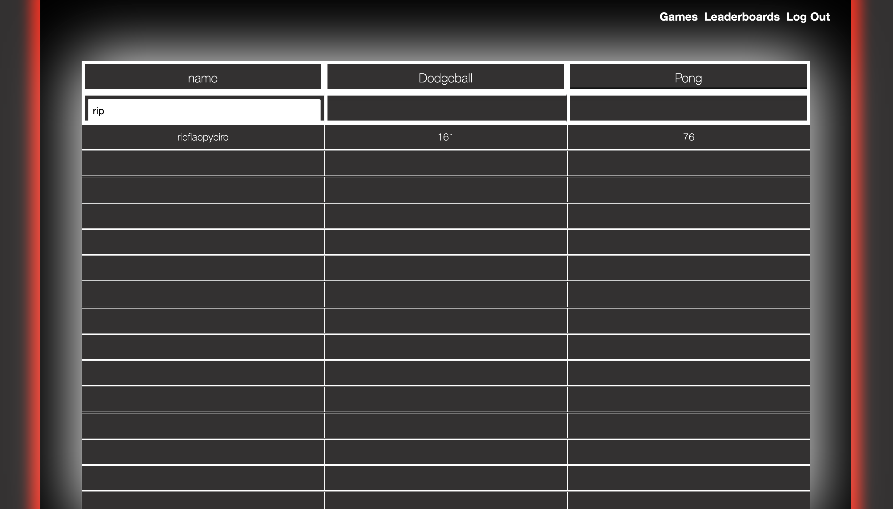

# React Games
<a href="https://reactgames.herokuapp.com/">Veiw deployed app here</a>

# Table Of Contents
- [User Story](#User-Story)
- [Summary](#Summary)
- [Installation](#Installation)
- [Overview](#Use)
- [Technologies Used](#Tech-Used)
- [Developers](#Developers)
- [License](#license)

## User Story

As a user, I want to be able to challenge my peers in 2bit style games. I would like see their scores in leaderboards page and sort to see who has scored how many points in what games they have played. 

## Summary
React Games, this is a game center where you can challenge yourself as well as your peers. Play 2bit games and see if you can beat your friends high schore or set a high score for yourself and send to a friend to challenge them and see if they can top your high schore. 

## Installation
### Available Scripts & to run the application from your computer once you have cloned the repo:
In the project directory, you can run:

### 'npm install'
This will install all dependencies in order to run the React Application.

### 'npm start'
Runs the app in the development mode.
Open http://localhost:3000 to view it in the browser.

The page will reload if you make edits.
You will also see any lint errors in the console.

## Overview
When the users first access the site, the user will be greeted with a landing page which they have the choice to login if they already have an account. If they do not login, no games or leaderboard pages will able to be accessed. If they do not have an account they can set one up in a matter of seconds by entering a username, email and password. After a successful login the user will be redirected to the game center where they can now select a game to play.

### Dodgeball
If the user selects Dodgeball, they will be taken into the game and be prompted with instructions on how to start the game. "Press Spacebar To Begin." Once spacebar is pressed the game is started and the user can then navigate their way through the pillars of Dodgeball. If it is the users first time playing, the score will save in the leaderboard upon their first collision with a pillar. If the user is a returning user then the score in the leaderboard will only update if their current score is higher than their previous score stored in the leaderboard. 

### Pong
If the user selects Pong, they will be taken into the game, this game will run as soon as the page is loaded so be ready. Use the "up" and "down" arrow keys to control your slider on the left hand side of the viewport. If it is the users first time playing, the score will save in the leaderboard upon their first loss to AI. In this game if the AI gets a score of 5 then you automatically lose. If the user is a returning user then the score in the leaderboard will only update if their current score is higher than their previous score stored in the leaderboard. 

### Leaderboard
The leaderboard page can only be viewed once the user has successfully logged in. Here the user can search their high scores or a friends by username. They can also sort the scores highest-lowest or lowest to highest. 

## Technologies Used
<ul>
<li>JWT Authentication</li>
<li>React.js</li>
<li>JavaScript</li>
<li>Node.js</li>
<li>Express</li>
<li>MongoDB</li>
<li>Mongoose</li>
<li>bcrypt</li>
<li>React-Table</li>
<li>Heroku Hosting</li>
</ul>

## Developers
<ul>
<li>Brock Thigpen - Back end - React, Javascript, Database, Authentication, React Table implentation</li>
<li>Brandon "Tyler" Cauley - Front end - Game Integration, Back end - Game integration, React, Javascript</li>
<li>Josh Craig - Designing the UI, Wireframe, Styling, Layout, Theme</li>
<li>Patrick Dorgu - React Table - Leaderboard</li>
</ul>

## MIT License

Copyright (c) 2020 Brock Thigpen, Brandon "Tyler" Cauley, Josh Craig, Patrick Dorgu

Permission is hereby granted, free of charge, to any person obtaining a copy of this software and associated documentation files (the "Software"), to deal in the Software without restriction, including without limitation the rights to use, copy, modify, merge, publish, distribute, sublicense, and/or sell copies of the Software, and to permit persons to whom the Software is furnished to do so, subject to the following conditions:

The above copyright notice and this permission notice shall be included in all copies or substantial portions of the Software.

THE SOFTWARE IS PROVIDED "AS IS", WITHOUT WARRANTY OF ANY KIND, EXPRESS OR IMPLIED, INCLUDING BUT NOT LIMITED TO THE WARRANTIES OF MERCHANTABILITY, FITNESS FOR A PARTICULAR PURPOSE AND NONINFRINGEMENT. IN NO EVENT SHALL THE AUTHORS OR COPYRIGHT HOLDERS BE LIABLE FOR ANY CLAIM, DAMAGES OR OTHER LIABILITY, WHETHER IN AN ACTION OF CONTRACT, TORT OR OTHERWISE, ARISING FROM, OUT OF OR IN CONNECTION WITH THE SOFTWARE OR THE USE OR OTHER DEALINGS IN THE SOFTWARE.
